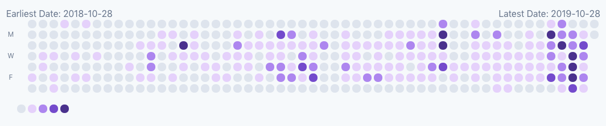

# Render Git contributions from Gitlab and/or Github in a Blade file

[](https://packagist.org/packages/m50/laravel-git-contributions-calendar)
[](https://travis-ci.org/m50/laravel-git-contributions-calendar)
[](https://github.styleci.io/repos/217633811)
[](https://packagist.org/packages/m50/laravel-git-contributions-calendar)

Allows rendering of a calendar in blade with your git contributions.

An example of what it can look like:



## Install

First install the package and publish the files:
```sh
composer install m50/laravel-git-contributions-calendar
php artisan vendor:publish
```
Add the Service Provider:
```php
m50\GitCalendar\Providers\ContribCalendarServiceProvider::class,
```

## Usage

You will want to rely on caching, because of the roundtrip time for the requests.
It's important to add the schedules job:
```php
$schedule->job(new CacheEventData(app(GithubApi::class)))
    ->daily();
```
Then it's also recommended that where you are pulling the data (your controller
for example) to kick off a new queue job to re-cache the data:
```php
$data = Cache::get(
    'git-contrib-data',
    function () {
        $this->dispatch(new CacheEventData(app(GithubApi::class)));
        return new GitData();
    }
);
if (app()->environment('Production')) {
    $this->dispatch(new CacheEventData(app(GithubApi::class)));
}
```

*Note: The default view relies on [TailwindCSS](https://tailwindcss.com/).*

## Credits

* [Marisa Clardy](https://github.com/m50)
